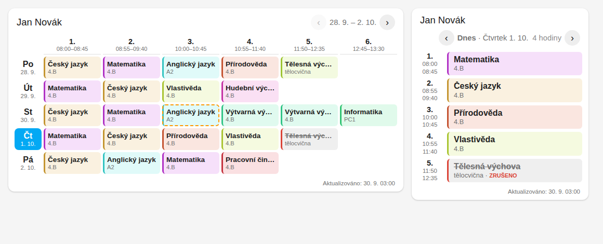

# Edookit pro Home Assistant

[](https://hacs.xyz/)
[](https://github.com/joshuaaaaa/HA-edookit/actions/workflows/validate.yml)

Neoficiální integrace školního systému [Edookit](https://edookit.com/) do Home Assistanta.
Přihlásí se stejným účtem jako rodič nebo žák na portálu školy (`https://<škola>.edookit.net`)
a přinese do HA **rozvrh, zprávy, známky, domácí úkoly, písemky, akce školy, absence a platby**.
Součástí je i **samostatná karta s rozvrhem** do dashboardu.



> ⚠️ Edookit nemá pro rodiče veřejné API. Integrace čte webový portál stejně jako prohlížeč.
> Když Edookit změní vzhled stránek, může být potřeba upravit parser. V takovém případě pomůže
> služba [`edookit.dump_pages`](#služby) a issue na GitHubu.

## Co umí

| Oblast | Entity / funkce |
|---|---|
| **Rozvrh** | stahuje se **jednou denně v čase, který si nastavíte** (výchozí 05:00), a také při startu HA nebo tlačítkem *Aktualizovat* |
| Dnešek a zítřek | počet hodin dnes / zítra, aktuální a další hodina (mění se každou minutu), začátek a konec vyučování, začátek dalšího školního dne (pro budík), binární senzory *Škola dnes*, *Škola zítra*, *Probíhá hodina* |
| Změny | senzor *Změny v rozvrhu* (suplování a zrušené hodiny), v kartě čárkovaně/přeškrtnutě |
| Zprávy | počet nepřečtených, poslední zpráva (odesílatel, náhled, odkaz) |
| Známky | poslední známka, seznam známek, **vážené průměry po předmětech** |
| Úkoly a písemky | nadcházející domácí úkoly a písemky s termíny |
| Akce školy | výlety, prázdniny, třídní schůzky (`/timetable/upcoming`) |
| Vyžaduje akci | platby, ankety, souhlasy čekající na rodiče |
| Absence | záznamy absence, počet neomluvených |
| Platby | dlužná částka v Kč a seznam nezaplacených plateb s VS |
| Kalendáře | `calendar.*_rozvrh` (každá hodina) a `calendar.*_skolni_diar` (akce, písemky, úkoly) |
| Notifikace | událost `edookit_new_item` pro každou novinku + hotový blueprint |
| Volitelně | veřejné akce školy a suplování z webového API školy, rozvrh z iCal odkazu, oficiální REST API Edookitu (pokud vám škola dala přístup) |

## Instalace

### HACS (doporučeno)

1. HACS → ⋮ → **Vlastní repozitáře** → URL `https://github.com/joshuaaaaa/HA-edookit`, typ **Integrace**.
2. Najděte **Edookit**, nainstalujte a **restartujte Home Assistant**.
3. **Nastavení → Zařízení a služby → Přidat integraci → Edookit**.

### Ručně

Zkopírujte složku `custom_components/edookit` do `/config/custom_components/` a restartujte HA.

## Nastavení

| Pole | Popis |
|---|---|
| Škola | subdoména nebo adresa portálu, např. `zs-priklad` nebo `https://zs-priklad.edookit.net` |
| E-mail / uživatelské jméno, heslo | stejné údaje jako pro přihlášení na portál; u přihlášení **„+4U Access“** zadejte **přístupový kód 1** jako uživatele a **přístupový kód 2** jako heslo |
| Způsob přihlášení | *Automaticky* (doporučeno – e-mail → heslo Plus4U, jinak přístupové kódy), *Plus4U (e-mail + heslo)*, *Plus4U +4U Access (přístupové kódy)* nebo *Klasický formulář Edookitu* (starší instalace) |
| Plus4U OIDC client id | nechte prázdné, viz [Řešení problémů](#řešení-problémů) |

Pro každé dítě s vlastním účtem přidejte integraci znovu.

### Možnosti (Nastavit → Možnosti)

| Volba | Výchozí | Popis |
|---|---|---|
| **Čas denní aktualizace rozvrhu** | 05:00 | kdy se má rozvrh každý den stáhnout |
| Interval aktualizace zpráv, známek a úkolů | 60 min | `0` = jen jednou denně spolu s rozvrhem |
| Počet načítaných týdnů rozvrhu | 2 | aktuální + následující týden(y); o víkendu se začíná příštím týdnem |
| Zdroj rozvrhu | Automaticky | *Portál* (webová stránka), *iCal adresa*, *REST API* |
| Vyvolávat událost `edookit_new_item` | zapnuto | pro notifikace |
| Načítat veřejné akce školy a suplování | vypnuto | veřejné API, které školy používají na svém webu (`<škola>-login.edookit.net/api/public/...`) |
| iCal adresa rozvrhu | – | pokud máte odkaz na kalendář s rozvrhem, je to nejspolehlivější zdroj |
| REST API uživatel / heslo / ID žáka | – | jen pokud vám škola vystavila přístup k [API Edookitu](https://edookit.com/sluzby-api); rozvrh se pak bere z `/api/lesson/v2/list-lessons` |

## Karta rozvrhu

Karta se **zaregistruje automaticky** s integrací – nemusíte přidávat žádný zdroj (resource).
V dashboardu: **Přidat kartu → Edookit rozvrh**, nebo YAML:

```yaml
type: custom:edookit-timetable-card
entity: sensor.edookit_jan_novak_rozvrh
```

| Volba | Výchozí | Popis |
|---|---|---|
| `entity` | – | senzor **Rozvrh** z integrace (povinné) |
| `title` | jméno žáka | nadpis (`""` = bez nadpisu) |
| `view` | `auto` | `week` = týdenní mřížka (dny × hodiny), `day` = seznam na jeden den, `auto` = podle šířky karty |
| `show_room` | `true` | učebna |
| `show_teacher` | `false` | vyučující |
| `show_times` | `true` | časy hodin |
| `show_footer` | `true` | čas poslední aktualizace |
| `highlight_now` | `true` | zvýraznit probíhající hodinu |
| `short_names` | `auto` | zkratky předmětů v úzké mřížce (`true` / `false` / `auto`) |
| `next_week_from` | `friday_after_school` | kdy přepnout na další týden: `friday_after_school`, `saturday`, `never` |
| `subject_colors` | – | vlastní barvy, např. `{Matematika: "#7e57c2"}`; jinak se barva odvodí z názvu |

Šipkami se přepínají týdny (resp. dny), kliknutím na datum se vrátíte na dnešek. Kliknutím na
nadpis otevřete detail entity. Zrušené hodiny jsou přeškrtnuté, změněné (suplování) mají čárkovaný rámeček.

Karta jen zobrazuje data senzoru – rozvrh se stahuje jednou denně v nastavený čas.
Kartu lze použít i bez HACS ručně: soubor je v `custom_components/edookit/frontend/edookit-timetable-card.js`
a integrace ho servíruje na `/edookit/edookit-timetable-card.js`.

Další příklady (úkoly, průměry, kalendář) najdete v [`examples/dashboard.yaml`](examples/dashboard.yaml).

## Entity

Názvy entit se tvoří z jazyka HA při přidání integrace (zde česky, žák „Jan Novák“):

| Entita | Stav | Důležité atributy |
|---|---|---|
| `sensor.edookit_jan_novak_rozvrh` | počet hodin dnes | `days` (celý rozvrh pro kartu), `bell` (zvonění), `today`, `source`, `last_update` |
| `sensor.…_hodiny_zitra` | počet hodin zítra | `lessons`, `subjects`, `next_school_day` |
| `sensor.…_aktualni_hodina` / `…_dalsi_hodina` | předmět | `start`, `end`, `room`, `teacher`, `minutes_left` / `minutes_until` |
| `sensor.…_zacatek_vyucovani_dnes`, `…_konec_vyucovani_dnes`, `…_zacatek_dalsiho_skolniho_dne` | čas (timestamp) | |
| `sensor.…_zmeny_v_rozvrhu` | počet | `changes` |
| `sensor.…_neprectene` | počet | `items` |
| `sensor.…_posledni_zprava` | předmět zprávy | `from`, `preview`, `url`, `messages` |
| `sensor.…_posledni_znamka` | známka | `subject`, `topic`, `weight`, `grades` |
| `sensor.…_prumer_znamek` | průměr | `subjects` (vážený průměr po předmětech) |
| `sensor.…_domaci_ukoly`, `…_pisemky`, `…_akce_skoly`, `…_vyzaduje_akci` | počet | `items`, `next` |
| `sensor.…_absence` | počet záznamů | `unexcused`, `records`, `stats` |
| `sensor.…_platby_k_uhrade` | Kč | `unpaid` |
| `sensor.…_posledni_aktualizace` (diagnostika) | čas | `errors` – co se nepodařilo načíst |
| `binary_sensor.…_skola_dnes`, `…_skola_zitra`, `…_probiha_hodina`, `…_neprectene_zpravy` | on/off | |
| `calendar.…_rozvrh`, `calendar.…_skolni_diar` | kalendáře | |
| `button.…_aktualizovat` | stáhne vše hned | |

## Notifikace a automatizace

Při každé novince (zpráva, známka, úkol, písemka, akce, anketa…) integrace vyvolá událost:

```yaml
event_type: edookit_new_item
data:
  type: evaluation          # inboxMessage | evaluation | assignment | exam | event | poll | actionRequired
  type_label: Hodnocení
  title: Matematika - Zlomky
  grade: "1"
  creator: Ing. Karel Dvořák
  url: https://skola.edookit.net/evaluation/detail?evaluationId=55
  student: Jan Novák
```

Při prvním načtení se nic neohlašuje (aby nepřišlo 50 notifikací najednou).

* **Blueprint** pro notifikace do mobilu:
  [](https://my.home-assistant.io/redirect/blueprint_import/?blueprint_url=https%3A%2F%2Fgithub.com%2Fjoshuaaaaa%2FHA-edookit%2Fblob%2Fmain%2Fblueprints%2Fautomation%2Fedookit%2Fedookit_notify.yaml)
* Další příklady (budík před první hodinou, co zabalit na zítra, hlášení známek) jsou v
  [`examples/automations.yaml`](examples/automations.yaml).

## Služby

| Služba | Popis |
|---|---|
| `edookit.refresh` | stáhne hned rozvrh (`what: timetable`), ostatní data (`what: data`) nebo vše |
| `edookit.get_timetable` | vrátí hodiny pro období (`start_date`, `end_date`) – použitelné v automatizacích a skriptech (`response_variable`) |
| `edookit.dump_pages` | uloží HTML všech stránek portálu do `/config/edookit_debug/` – pro opravu parseru. **Obsahuje osobní údaje, před sdílením je anonymizujte.** |

## Jak to funguje

* **Přihlášení**: rodiče a žáci se do Edookitu přihlašují přes **Plus4U** (OpenID Connect).
  Integrace si z přihlašovací stránky školy zjistí OIDC klienta, přihlásí se e-mailem a heslem
  (nebo přístupovými kódy +4U Access)
  a uloží si cookies (v `.storage`), takže se nepřihlašuje znovu při každém restartu.
  Když session vyprší, přihlásí se znovu sama. Starší školy s vlastním formulářem Edookitu jsou podporované taky.
* **Rozvrh** se čte ze stránky `/timetable/` (aktuální a další týdny), případně z iCal odkazu nebo REST API.
* **Ostatní data**: `/overview/updates` (zprávy a novinky), `/evaluation/list`, `/assignments/`,
  `/exams/`, `/timetable/upcoming`, `/attendance/`, `/payments/` a nástěnka. Moduly, které škola
  nemá zapnuté, se přeskočí.
* Integrace jen čte, nic na portál neodesílá (neomlouvá absenci, neposílá zprávy).

## Řešení problémů

**Přihlášení selhává**
* Zkuste se přihlásit na `https://<škola>.edookit.net` v prohlížeči. Pokud Plus4U chce reCAPTCHA
  nebo dvoufázové ověření, integrace to neumí – po přihlášení v prohlížeči to zkuste za chvíli znovu.
* **Přístupové kódy (+4U Access)**: kódy se nejdřív ověří u Plus4U (`/oidc/grantToken`), takže špatné
  kódy hlásí jasnou chybu. Samotné přihlášení do Edookitu pak jde přes `/authAccessCodes/authenticate`;
  tenhle krok nebyl ověřen proti živému Plus4U – pokud selže, zapněte ladicí log a pošlete
  řádky `Access code login via …` v issue. Účty s dvoufázovým ověřením ani přihlášení přes
  Google/Microsoft podporované nejsou.
* **OIDC client id**: pokud automatické zjištění selže, v prohlížeči otevřete
  vývojářské nástroje (F12) → Síť, přihlaste se a najděte požadavek na
  `uuidentity.plus4u.net/.../oidc/auth?...client_id=XXXXXXXX`. Hodnotu `client_id`
  zadejte do pole *Plus4U OIDC client id*.

**Rozvrh je prázdný nebo špatně**
* Podívejte se na atributy senzoru *Poslední aktualizace* (`errors`) a do logu.
* Pokud škola nabízí iCal odkaz s rozvrhem, nastavte ho v možnostech – je to nejspolehlivější.
* Zavolejte službu `edookit.dump_pages` a pošlete anonymizovaný `timetable.html` v issue –
  parser se upraví.

**Ladicí log**
```yaml
logger:
  logs:
    custom_components.edookit: debug
```

## Vývoj

```bash
pip install -r requirements_test.txt ruff
pytest
ruff check custom_components tests
```

Testy pokrývají parsery (na ukázkovém HTML), přihlašovací tok Plus4U i klasický formulář
(proti simulovanému serveru), config flow, entity, služby a události.

## Licence a upozornění

MIT. Projekt není nijak spojen se společností Edookit s.r.o. ani Unicorn (Plus4U).
Přihlašovací údaje se ukládají jen lokálně v Home Assistantu.
